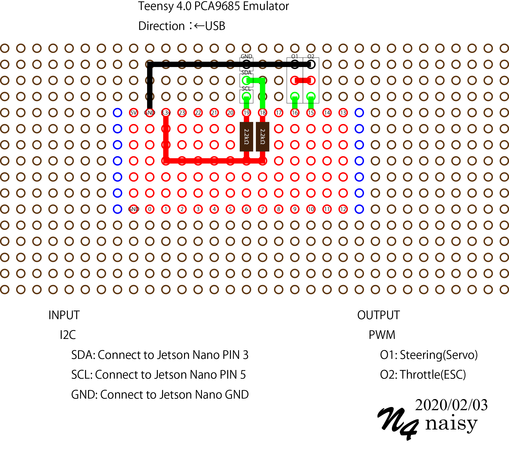

# teensy40_pca9685
Teensy 4.0 PCA9685 Emulator

This repository is based on [https://github.com/jwatte/donkey_racing/tree/master/teensy_hat_firmware](https://github.com/jwatte/donkey_racing/tree/master/teensy_hat_firmware). 
It is expensive if you use only the PCA9685 emulator. But Teensy 4.0 is a very good board and I hope this helps you to use with other features.

 

## Requirements:
* [Arduino IDE 1.8.11](https://www.arduino.cc/en/main/software)
* [Teensyduino 1.5.0](https://forum.pjrc.com/forums/6-Announcements)
* [teensy4_i2c](https://github.com/Richard-Gemmell/teensy4_i2c)

## Install:
* Install Arduino IDE. Download and unzip.
* Install Teensyduino. Choose arduino installed directory.
* Install teensy4_i2c. git clone teensy4_i2c, and copy the directory into arduino libraries.
* delete arduino/libraries/Servo directory.

## References:
* [https://github.com/jwatte/donkey_racing/tree/master/teensy_hat_firmware](https://github.com/jwatte/donkey_racing/tree/master/teensy_hat_firmware)
* [https://github.com/csalinasonline/donkeyCarArduinoPWM](https://github.com/csalinasonline/donkeyCarArduinoPWM)
* [https://forum.pjrc.com/forums/6-Announcements](https://forum.pjrc.com/forums/6-Announcements)
* [https://github.com/Richard-Gemmell/teensy4_i2c](https://github.com/Richard-Gemmell/teensy4_i2c)
* [https://forum.arduino.cc/index.php?topic=459632.0](https://forum.arduino.cc/index.php?topic=459632.0)